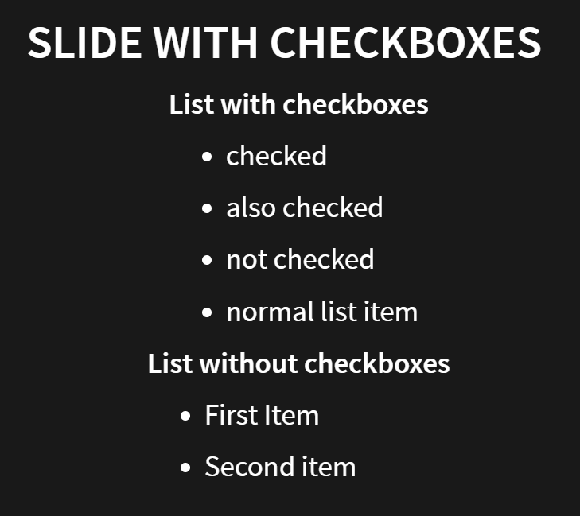
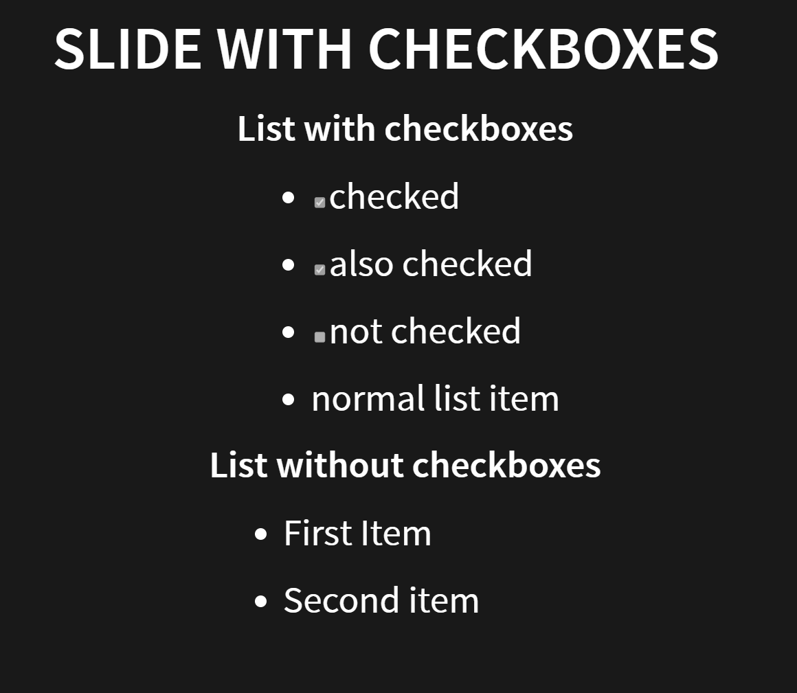
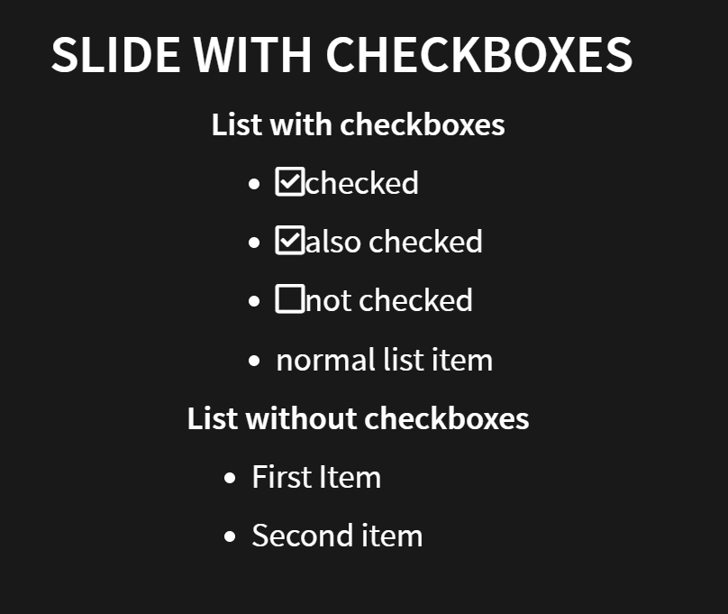
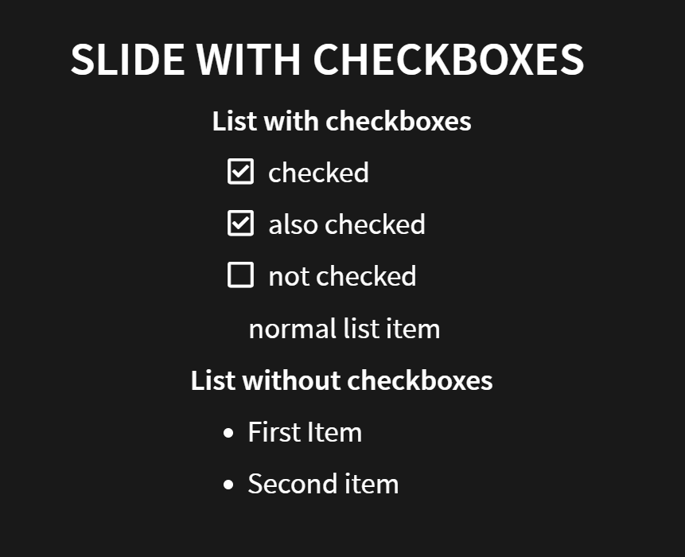

When enabling Fontawesome for icons (`:icons: font`), checklists do not contain any checkboxes:

Checkboxes are shown without Fontawesome - but not scaled with the font (see [#451](https://github.com/asciidoctor/asciidoctor-reveal.js/pull/451)):

Workarounds that I use:

Workaround 1: Replace icon class `icon-check` with `far fa-check-square` and `icon-check-empty` with `far fa-square` in `docinfo-footer-revealjs.html`:

Workaround 2: Remove bullets and improve spacing in custom CSS (does not look nice for mixed lists, but I do not use those):

Possible fixes:

* Show checkbox icons: Replace icon class `icon-check` with `far fa-check-square` and `icon-check-empty` with `far fa-square` in `templates/ulist.html.slim` and `lib/asciidoctor-revealjs/converter.rb`.

* Remove bullets in check lists and fix spacing: Maybe [#451](https://github.com/asciidoctor/asciidoctor-reveal.js/pull/451) would solve that.